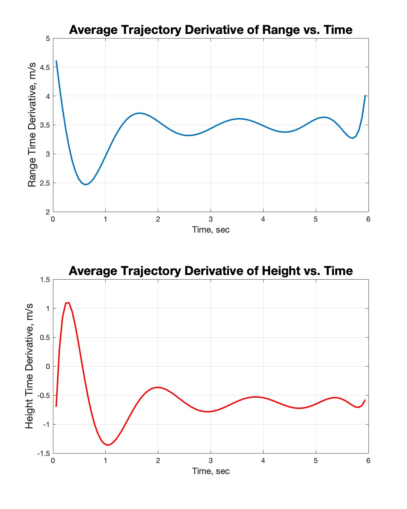

  # Paper Airplane Numerical Study
  Final Project: AEM 3103 Spring 2024

  - By: Luth Khairulhuda

  ## Summary of Findings
  <Show the variations studied in a table>

  The 2D equilibrium glide of a paper airplane at max lift-to-drag ratio was studied to determine the flight trajectory and associated properties. To account for variations in initial velocity and flight path angle conditions, two separate simulations were performed. The first varied initial velocity and flight path angle independently of one another, with three values of low, nominal, and high as shown in Figure 1 to see how they would affect the trajectory. Then, to account for the randomness of the launching apparatus, Figure 2 shows a Monte Carlo simulation performed with 100 random initial velocities and flight path angles with ranges between 2 to 7.5 m/s and -0.5 to 0.4 radians respectively. The average trajectory was fit using a 10th-order polynomial, and its range and height time derivatives were calculated as shown in Figure 3. 

  Increasing initial velocity seemed to increase the glide range of the paper airplane, while high and low variations on the nominal initial flight path angle decreased the glide range. Accounting for the random range of variations in the two parameters, the average trajectory overshoots the expected nominal glide range of the paper airplane. Thus, to show equilibrium glide more accurately, modifications to the launching procedure or hardware must be made to decrease variation, specifically in initial velocity. 

 
  # Code Listing
  A list of each function/script and a single-line description of what it does.  The name of the function/script should link to the file in the repository on GitHub.
  - [PaperPlane.m](./PaperPlane.m)
    - Script:  Main executable which is run to generate all simulated trajectories.
  - [EqMotion.m](./EqMotion.m)
    - Function: Calculates the fourth-order equations of motion of the paper airplane.
  - [setup_sim.m](./setup_sim.m)
    - Function: Sets up initial simulation values for all paper airplane properties. 
  - [num_der_central](./num_der_central.m)
    - Function: Numerically calculates the central derivative given two arrays.

  # Figures

  ## Fig. 1: Single Parameter Variation
  

  Shows the effects on the 2D trajectory of three different initial velocities and flight path angles varied independently for the paper airplane. 

  ## Fig. 2: Monte Carlo Simulation
  

  100 test cases, each with random initial velocities and flight path angles, were simulated and their 2D trajectories are plotted.

 ## Fig. 3: Time Derivatives
 

  The velocity and vertical velocity of the paper airplane as it follows the average trajectory/polyfit found by the Monte Carlo simulation.
